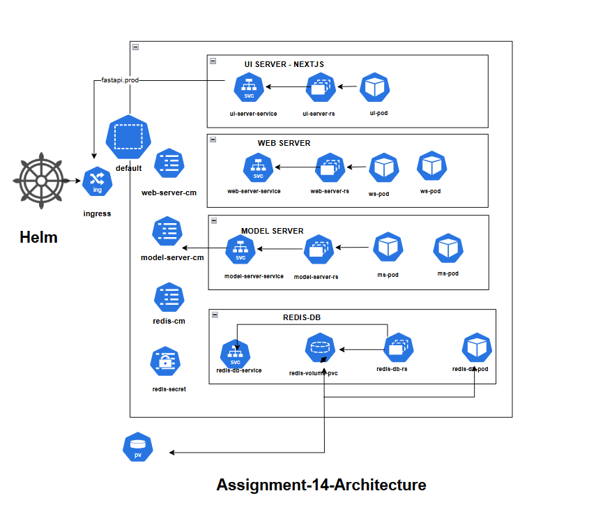
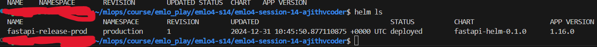
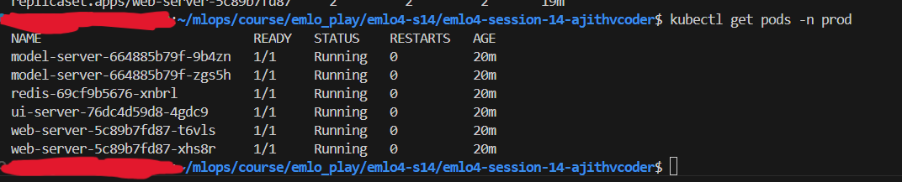

## EMLOV4-Session-14 Assignment - Kubernetes - II: Ingress, ConfigMap, Secrets, Volumes and HELM

Note: **I have completed actual assignment and first part of bonus assignment(`ngrok`)**

### Contents

- [Requirements](#requirements)
- [Development Method](#development-method)
    - [Architecture Diagram](#architecture-diagram)
    - [Docker file development-Model-service development-Web-service development](#docker-file-development-model-service-development-web-service-development)
    - [Minikube development](#minikube-development)
    - [Deploy with HELM](#deploy-with-helm)
    - [Bonus assignment](#bonus-assignment)
- [Learnings](#learnings)
- [Results Screenshots](#results-screenshots)

### Requirements

- Design a deployment to deploy the Cat/Dog or Dog Classifier on K8S
    - You must first create a architecture diagram and show all pods, replicasets, deployments, service, ingress, volumes and nodes that will be involved in this deployment
    - Use diagrams.netLinks to an external site. for the diagram
    - write the code for model server, web server and test it with docker-compose first
    - you must be using a redis cache for inference results caching
    - create k8s manifests for the same
    - You’ll need to figure out the peak cpu and memory usage with kubectl top pod
- Deploy on K8S using the manifests
- Create HELM Chart with configurable values
- Deploy with HELM
- You must use minikube either on your local machine or on an EC2 instance
- What to Submit?
    - Github Repo with Deployment YAML Files
    1. Instructions to
        - Deploy using HELM Chart
        - Tunnel to the Ingress
        - Screenshot of the fastapi docs page with one inference done
    2. Output of the following in a .md file in your repository
        - kubectl describe <your_deployment>
        - kubectl describe <your_pod>
        - kubectl describe <your_ingress>
        - kubectl top pod
        - kubectl top node
        - kubectl get all -A -o yaml

**BONUS**

- Use ngrok ingress to expose your deployment to internet
- Deploy a basic frontend in Next.JS to do model inferencing

### Architecture Diagram



Note: 

- You can refer dev/docker-dev for docker development related testings

- You can refer dev/minikube-dev for minikube development and manifest file related testings. No helm charts there

### Docker file development-Model-service development-Web-service development

**Build**

- `docker build -t model-server -f Dockerfile.model-server .`
- `docker build -t web-server -f Dockerfile.web-server .`
- `docker network create my_network`

Docker network is needed for communication between two containers

**Start Servers**

Model server

Note:

1. I am downloading model inside docker file so dont mount anything in model-server else download in local also and then mount.
2. Modify the server port.

- `docker run -it --network my_network -v /home/ajith/mlops/course/emlo_play/emlo4-s14/emlo4-session-14-ajithvcoder/src/model-server:/opt/src -p8000:8000 model-server bash`
- `python server.py`

Web server

- `docker run -it --network my_network  -v /home/ajith/mlops/course/emlo_play/emlo4-s14/emlo4-session-14-ajithvcoder/src/web-server:/opt/src -p9000:9000 web-server bash`
- `python server.py`

**Testing both services**

Note: remember @ before the filepath

- `curl -X POST http://localhost:8000/infer -H "Content-Type: multipart/form-data" -F "image=@dog.jpg"`

- `curl -X POST http://localhost:9000/classify-imagenet -H "Content-Type: multipart/form-data" -F "image=@dog.jpg"`

- After testing this you can proceed with `minikube`

### Minikube development

- `minikube start`

Add alias for easier cli work

- `alias kubectl="minikube kubectl --"`

Kubernetes environment build docker images

- `eval $(minikube docker-env)`
- `docker build --platform linux/amd64 -t model-server -f Dockerfile.model-server  .`
- `docker build --platform linux/amd64 -t web-server -f Dockerfile.web-server  .`
- `eval $(minikube docker-env -u)`

Inside `dev/minikube-dev` you can run below command for testing all services

- `kubectl apply -f .`

After testing

- `kubectl delete -f .`

### Deploy with HELM

- Config maps - used to deploy varitey of services like `prod` and `dev` with helm commands that makes easier configuration and testing -> `redis.cm.yml`, `model-service.cm.yml`, `web-service.cm.yml`.
- Secrets - used to hold passwords for services like redis -> `redis.secret.yml`
- Namespace - a tag and environemnt to seperate different deployments and relates services
- `Volume` - redis has a peresistent volume -> `redis.volume.yml`

Create a namespace `production` for production deployments

- `kubectl create namespace production`

Change the current environment namespace

- `kubectl config set-context --current --namespace=production`

In manifest file `value-prod.yaml` i have provided `pro` namespace and `pro` environment so while accessing pods you need
to query the namespace `prod`

- `helm install fastapi-release-prod fastapi-helm --values fastapi-helm/values.yaml -f fastapi-helm/values-prod.yaml`


```
NAME: fastapi-release-prod
LAST DEPLOYED: Sat Dec 30 14:40:03 2024
NAMESPACE: production
STATUS: deployed
REVISION: 1
TEST SUITE: None
```

These are my services, deployment and pods for prod deployment


Ensure that in `kubectl get pod -n prod` all pods are in running state



Exposes ports to host for testing and usage

- `minikube service model-server-service -n prod`

- `minikube service web-server-service  -n prod`

**Only if you want another set of deployments for dev**
- `kubectl create namespace production`
- `kubectl config set-context --current --namespace=production`
- `helm install fastapi-release-dev fastapi-helm --values fastapi-helm/values.yaml -f fastapi-helm/values-dev.yaml`

**Debugging pods or server**

- kubectl logs <`pod name`>

**Testing**

- `curl -X POST <http://127.0.0.1:43139/classify-imagenet> -H "Content-Type: multipart/form-data" -F "image=@dog.jpg"`

    ```
    {"class": dog, "confidence": 0.9892888878}
    ```

**Ingress Services**

In `/etc/hosts` add

```

127.0.0.1       fastapi.locahost        localhost

```

- Also do in  `C:\Windows\System32\drivers\etc\hosts` if you are in windows and using wsl. if not u can reach through curl in wsl but not in browser.

- `minikube addons enable ingress`
- `minikube tunnel`

- Note: In screenshot its accessible at `http://fastapi.prod` 


### Bonus assignment

**Expose to internet with ngrok**

Get auth token from ngrok website and use in below command

Authentication from ngrok

- `ngrok authtoken <your ngrok api>`

Forward port from pod to local

- `kubectl port-forward service/web-server-service  8080:80 -n prod`

Expose the port 8080 to internet

- `ngrok http 8080`

    


    

**Testing**

- Tested in two different devices

**Uninstall**

Uninstalling it brings down all services and pods down

- `helm uninstall fastapi-release-prod`

- if you have started exposing/forwarding any service like this `minikube service model-server-service` press `CNTRL+C` and exit 

- `kubectl delete namespace production`

- `minikube delete` -> deletes all containers and images in minikube docker environment

### Learnings

- Learnt a lot about kubernetes and its related services
- While mounting docker volume make sure the files inside docker also matches
- Checking status and logs of each pod and debugging
- Reload a pod `kubectl delete pods -l app=web-server`
- `Helm charts` and using values for easier configuration which is like `hydra` for `python`
- using `redis db` and `cache services` with fastapi and serving faster

### Results Screenshots

**Reports**

Reports of all commands given in assignment

- [reports](./report.md)

**Architecture**


**Helm deployment**




**Deployment testing**


**Ingress test**


**Bonus assignment results**


**Bonus assignment results Internet exposure: Another device**


### Group Members

1. Ajith Kumar V (myself)
2. Pravin Sagar
3. Hema M

