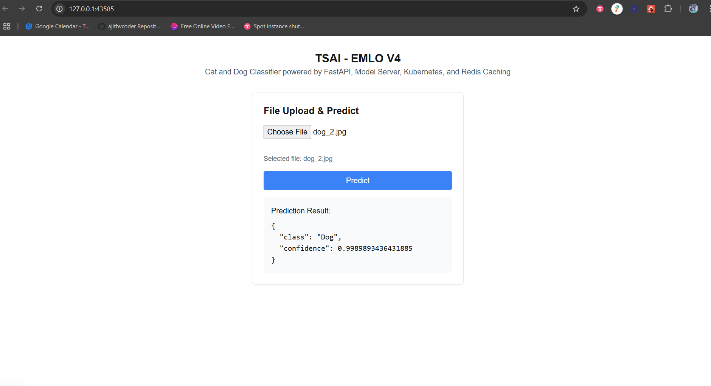

### Minikube development

- minikube start

Add alias for easier cli work

- `alias kubectl="minikube kubectl --"`

Kubernetes environment build docker images

- `eval $(minikube docker-env)`
- `docker build --platform linux/amd64 -t model-server -f Dockerfile.model-server  .`
- `docker build --platform linux/amd64 -t web-server -f Dockerfile.web-server  .`
- `docker build --platform linux/amd64 -t ui-server -f Dockerfile.ui-server  .`
- `eval $(minikube docker-env -u)`

Apply manifests

- `kubectl apply -f .`

Ensure that in `kubectl get pod` all `four` pods are in running state

- `minikube service model-server-service`
- `minikube service web-server-service`
- `minikube service ui-server-service`

**Debugging pods or server**

- kubectl logs <`pod name`>

**Testing**

- First request might take some time(~30 seconds) but successive request will be faster

- `curl -X POST <http://127.0.0.1:43139/classify-catdog> -H "Content-Type: multipart/form-data" -F "image=@dog.jpg"`

    ```
    {"class": dog, "confidence": 0.9892888878}
    ```

    

**Ingress Services**

- `minikube addons enable metrics-server`
- `minikube addons enable dashboard`
- `minikube addons enable ingress`
- `minikube tunnel`

- `minkube dashboard` - monitoring pods

In `/etc/hosts` add

```

127.0.0.1       fastapi.locahost        localhost

```

- Also do in  `C:\Windows\System32\drivers\etc\hosts` if you are in windows and using wsl. if not u can reach through curl in wsl but not in browser.